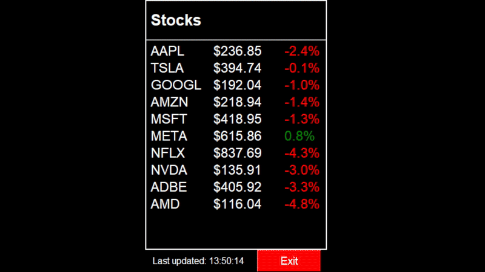

# **Mini Ticker**

A lightweight, fullscreen stock ticker built with Python and Tkinter. Ideal for Raspberry Pi or any Python-compatible system. Powered by the [Finnhub API](https://finnhub.io/).



## **Features**
- Real-time tracking for multiple stocks.
- Minimalistic, fullscreen design for small screens.
- Performance-based coloring (green for gains, red for losses).
- Fully customizable via `config.json`.
- Low memory usage: ~20 MB.

---

## **Installation**

1. Clone the repository:
   ```bash
   git clone https://github.com/your-username/mini-ticker.git
   cd mini-ticker
   ```

2. Install dependencies:
   ```bash
   pip install requests
   ```

3. Add your [Finnhub API key](https://finnhub.io/dashboard) to `config.json`.

4. Run the app:
   ```bash
   python3 main.py
   ```

---

## **Configuration**

Customize `config.json`:
- **Stocks**: Add tickers under `stocks`.
- **Colors**: Set `highlight_positive` (green) and `highlight_negative` (red).
- **Update Interval**: Set in seconds with `update_interval`.

---

## **Usage**

1. Start the ticker:
   ```bash
   python3 main.py
   ```

2. Exit fullscreen with `Ctrl+Q`.

---

## **License**
Licensed under the MIT License.
